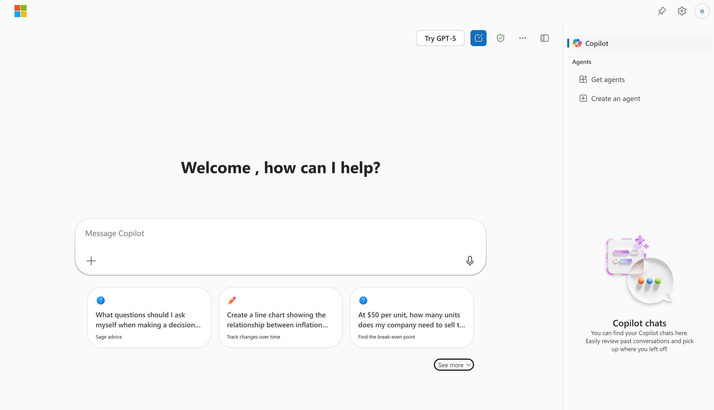
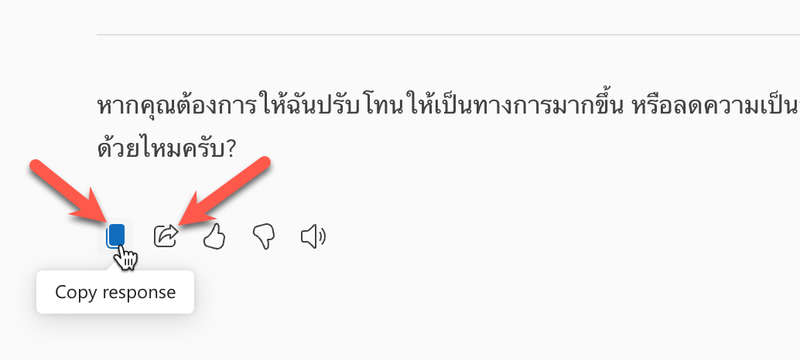
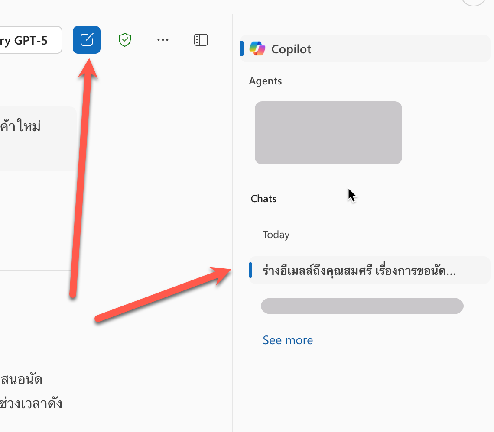
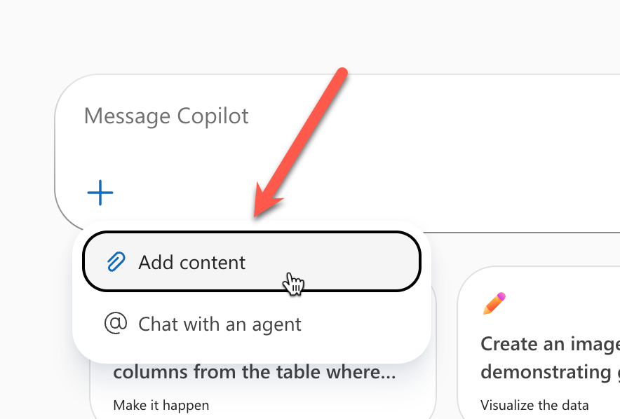
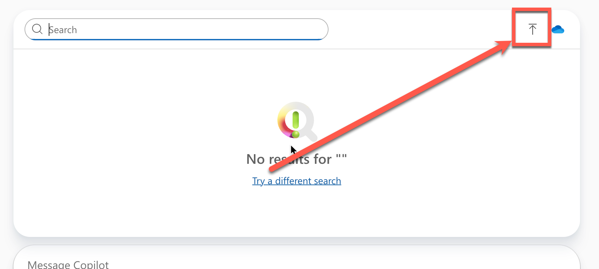

# Part 2: Copilot Chat


1. เปิด link https://m365copilot.com/
   - หรือ https://copilot.microsoft.com
2. Login ด้วย Microsoft account ขององค์กร
3. เราจะเห็นเข้ามาที่ Copilot Chat ตามภาพ

> ในบางกรณี อาจจะเห็นเมนูสลับข้างกับภาพตัวอย่าง แต่องค์ประกอบอยู่ครบก็โอเค



## Feature 1: การร่างอีเมลล์

1. เปิด link https://m365copilot.com/ 
2. คัดลอกข้อความด้านล่างไปใส่ในช่อง Chat โดยแก้ไข `[name]` เป็นชื่อของผู้รับ และ `[topic]` เป็นหัวข้อที่ต้องการพูดคุย

```
Draft an email to [name] about [topic].
```

ตัวอย่าง

```
ร่างอีเมลล์ถึงคุณสมศรี เรื่องการขอนัดคุยเรื่องงบประมาณโครงการสินค้าใหม่ โดยอยากนัดเวลา 10.00 น.
```

3. กด enter หรือกดส่ง (>)
4. ตรวจสอบผลลัพธ์ 
5. ทดสอบปรับสำนวนของแบบร่างอีเมลล์ โดยการคัดลอกข้อความด้านล่างไปใส่ในช่อง Chat

```
ปรับสำนวนให้เป็นทางการ และสุภาพ กระชับ และใส่เบอร์ติดต่อเป็น 02-123-4567
```

6. ตรวจสอบผลลัพธ์ 

```
ตัดเนื้อหาให้เหลือแค่เนื้อความ email
```

7. ตรวจสอบผลลัพธ์ 
8. กดปุ่มด้านล่างข้อความผลลัพธ์ เพื่อคัดลอกข้อความไปใช้



9. ทดสอบกดปุ่มแชร์ด้านข้าง และส่งให้เพื่อนเพื่อเปิดดูใช้งาน 

## Feature 2: Chat History 

1. จากหน้าจอปัจจุบันให้สังเกตด้านข้างที่มีการแสดงประวัติการสนทนา ซึ่งเราสามารถคลิกเพื่อดูรายละเอียดของการสนทนาก่อนหน้าได้
2. กดปุ่มสร้าง Chat ใหม่ด้านบน เพื่อขึ้นการสนทนาใหม่



3. คัดลอกข้อความด้่านล่างไปใส่ในช่อง Chat 

```
หาข่าว [องค์กร] ที่สำคัญในปี 2025
```

4. ตรวจสอบผลลัพธ์ 

## Feature 3: Working with File

1. 
2. ขึ้นห้องแชทใหม่
3. จากกล่องข้อความแชท ให้กดปุ่ม "+" และเลือก Add Content 



3. กดปุ่มเพื่อ upload ไฟล์ 



4. ใช้คำสั่งในการค้นหาข้อความภายในไฟล์ เช่น

```
ค้นหาคำว่า [keyword] ในไฟล์
```

3. ตรวจสอบผลลัพธ์
