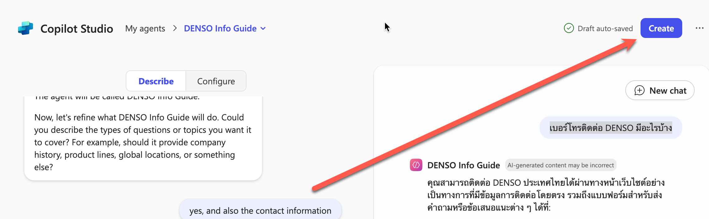
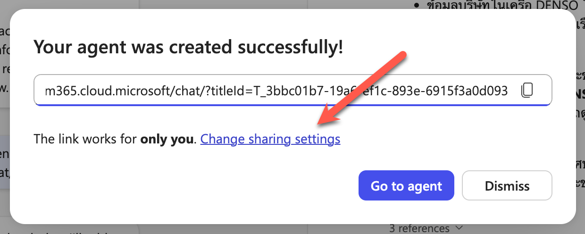
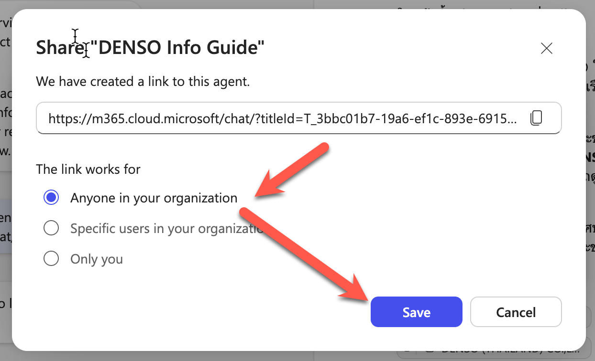
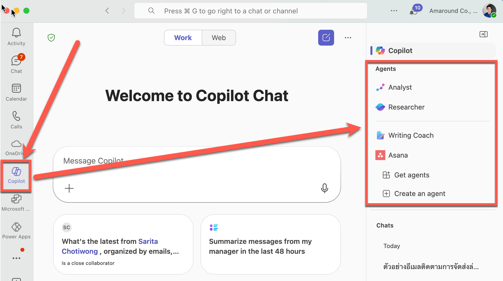

# สร้าง Agent AI ตัวแรกของคุณ

ข้อความโต้ตอบในแบบฝึกหัดนี้ของ Copilot อาจจะแตกต่างกันไป ซึ่งอาจจะเหมือน หรือไม่เหมือนกับตัวอย่างก็ได้ ให้พวกเราลองสังเกตดีๆ นะครับ


## ขั้นตอนการกำหนดหน้าที่ของ Agent แบบแชทคุยกัน (Describe)

1. เปิด Copilot Chat [https://m365copilot.com/](https://m365copilot.com/)
2. ในเมนูด้านข้าง ให้เลือก **Chat** > **Agents** > **Create Agent** หน้าต่างจะแยกเป็นด้านซ้ายสำหรับตั้งค่าการทำงานของ Agent ส่วนด้านขวาจะเป็นตัวอย่างพรีวิว Agent เพื่อให้ทดสอบพูดคุย
    
3. ขั้นตอนแรก Copilot จะถามให้เราอธิบายว่า Agent จะทำอะไรได้บ้าง ให้คัดลอกข้อความด้านล่างไปตอบให้แชท และกด enter
    
    ```
    You are an AI assistant for corporate expenses. You answer questions about expenses based on the expenses policy data.
    ```

4. ขั้นตอนถัดไป Copilot จะถามให้เรากำหนดชื่อของ Agent โดยเสนอชื่อมาให้ เราสามารถตอบตกลงตามข้อความด้านล่าง หรือจะเสนอชื่อใหม่ที่ต้องการก็ได้

    ```
    Yes
    ```
    หรือ
    ```
    [ชื่อองค์กร] HR Buddy
    ```

5. ต่อมา Copilot อาจจะทวนหน้าที่ของ Agent โดยมีการนำเสนอหน้าที่เพิ่มเติม ให้เราพิจารณา ในที่นี้เราอาจจะตอบด้วยข้อความด้านล่างว่า (ถ้า Copilot ไม่ได้บอก)

    ```
    quick answer, precise, and explain in step by step if needed
    ```

6. จากด้านบนกดเปิดไปยังส่วนของ Configure
7. ลงมาในส่วนของ Knowledge
8. กดปุ่ม Upload files และเลือกไฟล์ Expense_policy.docx เพื่ออัพโหลดไฟล์นโยบายค่าใช้จ่ายขององค์กรขึ้นไป
9. สังเกตว่าไฟล์จะถูกอัพโหลดขึ้นไป และแสดงในส่วนของ Knowledge sources
10. กดปิดตัวเลือก **Search All Websites** และกดเปิดตัวเลือก **Only use specified sources**


11. เมื่อให้ข้อมูลพอสมควรแล้ว เราสามารถทดสอบคุยกับ agent ได้เลย **จากห้องแชททางขวาได้เลย**
    ```
    ถ้าค่าเดินทางเปิด 5000 บาท สามารถเบิกได้ไหม
    ```

12. เมื่อพอใจแล้ว เราสามารถกดปุ่ม Create ด้านบนขวาของหน้าจอ Create Agent ได้
   

13. เมื่อ Agent ถูกสร้างเสร็จแล้ว เราสามารถเริ่มใช้งาน Agent ได้ทันที หรือจะกดเปลี่ยนรูปแบบการแชร์ ให้คนอื่นใช้งานด้วยก็ได้ 

    
    จากนั้นให้เลือก Anyone หรือ Specific User in your organization และกด Save
    
    เรียบร้อยแล้วก็สามารถ copy link เพื่อส่งให้เพื่อนในทีมเข้ามาใช้ในองค์กรได้เลย
    > เคล็ดลับ: โดยปกติ Agent ที่ถูกสร้างขึ้นจะสามารถใช้ได้เฉพาะตัวผู้สร้าง และเต็มที่คือภายในองค์กรของผู้สร้าง agent เท่านั้น

> เคล็ดลับ: ถ้าเราเพิ่ม agent เข้ามาในบัญชีแล้ว เรายังสามารถคุยกับ agent ผ่าน Microsoft Team ในส่วนของ Copilot ได้ด้วยนะ
> 