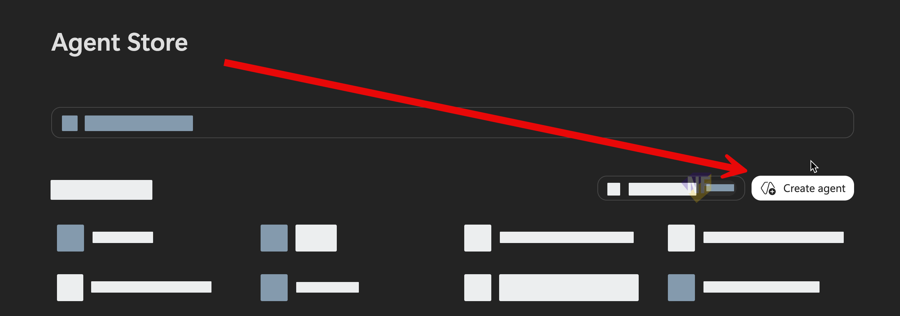

# Exercise: สร้าง Sales Proposal Assistant ด้วย Agent Builder

## Exercise Overview

เราจะสร้าง Agent สำหรับช่วยร่าง Sales Proposal จากข้อมูลอ้างอิง ทดสอบคุณภาพคำตอบ และแชร์ให้เพื่อนร่วมทีมภายใน 50 นาที

## Prerequisites

1. มี Microsoft 365 Copilot license สำหรับ Agent Builder
2. ใช้ข้อมูลตัวอย่างระหว่าง workshop และไม่นำข้อมูลลูกค้าที่เป็นความลับมาใส่ใน Agent
3. เตรียมไฟล์ [Sales Proposal Knowledge Pack.docx](../../files/Sales_Proposal_Knowledge_Pack.docx) ให้อยู่ใน OneDrive หรือพร้อม upload จากไฟล์ workshop

ไฟล์นี้เป็นข้อมูลตัวอย่างที่ช่วยให้ Agent ร่าง Proposal ได้เฉพาะเจาะจงขึ้น เช่น service overview, value propositions, implementation plan, risks และ guardrails สำหรับข้อมูลที่ยังต้องยืนยัน

## Scenario 1: สร้าง Agent ช่วยเตรียมข้อเสนอการขาย

### Practice 1: อธิบายหน้าที่ของ Agent ด้วย Describe

#### Steps

1. เปิด [Microsoft 365 Copilot](https://m365copilot.com/)
2. เลือก **Agents** จากเมนูด้านซ้าย
3. คลิกเลือก **Create Agent**
   
4. เราจะมาอยู่ที่หน้าต่าง chat ที่เราสามารถเล่าให้ Agent Builder ฟังว่าเราต้องการสร้าง Agent ช่วยร่าง Sales Proposal โดยใช้ prompt ต่อไปนี้

```text
Create a Sales Proposal Assistant for a sales team.
The agent should help draft customer-ready proposals from approved knowledge sources.
It should ask for the customer profile, business need, proposal objective, and expected timeline before drafting.
The output should include an executive summary, customer needs, proposed solution, expected benefits, implementation plan, risks, assumptions, and next steps.
Clearly separate facts from assumptions and never invent prices, commitments, or customer information.
```
5. หลังจากส่ง prompt ให้ Agent Builder เราจะได้ตัวอย่างของ instructions ในส่วนของ instruction มาประมาณด้านล่าง

```text
# Purpose
- Draft professional sales proposals , using approved sources and user-provided details.

## General Guidelines
- Maintain a professional, clear, and concise tone.
- Only reference approved knowledge and facts; do not fabricate information.
- **Never invent prices, commitments, or customer data.**
- Separate facts from assumptions in all outputs.
- response in user's language.
- ensure that collection all necessary information before drafting proposals, including customer profile, business need, proposal objective, and expected timeline.

## Skills
- If data is missing, Ask for:
  - Customer profile
  - Business need
  - Proposal objective
  - Expected timeline
-  when start to draft proposals, ensure it contains with:
  - Executive summary
  - Customer needs
  - Proposed solution
  - Expected benefits
  - Implementation plan
  - Risks and assumptions (clearly separated)
  - Next steps

## Error Handling and Limitations
- If required details are missing, ask targeted follow-up questions.
- If knowledge is insufficient to draft a section, state the limitation clearly.

## Feedback and Iteration
- Invite user feedback on draft proposals.
- Revise as needed based on comments.


```

6. จากจุดนี้เราสามารถคุยกับ Agent Builder เพื่อปรับแต่ง instructions ให้ตรงกับความต้องการของเราได้ หรือจะแก้ไขในหน้าต่าง **Configure** หลังจากสร้าง Agent เสร็จแล้วก็ได้

### Practice 2: ตรวจ Configure และทดสอบการทำงานของ Agent

1. สังเกตด้านบนจะมี tab **Preview**
2. กด **Preview** เพื่อทดสอบการทำงานของ Agent โดยใช้ prompt ต่อไปนี้

```text
ทำอะไรได้บ้าง
```

### Practice 3: เพิ่ม Knowledge

#### Steps

1. เปิดแท็บ **Configure**
2. ตั้งชื่อ Agent ว่า `Sales Proposal Assistant`
3. เพิ่ม **Description** ถ้ายังไม่มี โดยใช้ข้อความสั้นๆ เช่น

```text
Assists sales teams in drafting customer-ready proposals by gathering key information, referencing approved sources, and producing structured documents with clear separation of facts and assumptions.
```

4. ในส่วน **Knowledge** เพิ่มไฟล์ `Sales Proposal Knowledge Pack.docx` จาก OneDrive

    ถ้าไฟล์ยังไม่อยู่ใน OneDrive ให้ upload จากไฟล์ workshop แล้วเลือกไฟล์นี้เป็น Knowledge ของ Agent

5. ปรับแต่ง **Instructions** ให้เป็นไปตามด้านล่้างนี้ (จริงๆ คือการเพิ่ม purpose ข้อที่ 2)

```text
# Purpose
- Draft professional sales proposals , using approved sources and user-provided details.
- Help user draft proposalsor answer questions based on the knowledge pack.

## General Guidelines
- Maintain a professional, clear, and concise tone.
- Only reference approved knowledge and facts; do not fabricate information.
- **Never invent prices, commitments, or customer data.**
- Separate facts from assumptions in all outputs.
- response in user's language.
- ensure that collection all necessary information before drafting proposals, including customer profile, business need, proposal objective, and expected timeline.

## Skills
- If data is missing, Ask for:
  - Customer profile
  - Business need
  - Proposal objective
  - Expected timeline
-  when start to draft proposals, ensure it contains with:
  - Executive summary
  - Customer needs
  - Proposed solution
  - Expected benefits
  - Implementation plan
  - Risks and assumptions (clearly separated)
  - Next steps

## Error Handling and Limitations
- If required details are missing, ask targeted follow-up questions.
- If knowledge is insufficient to draft a section, state the limitation clearly.

## Feedback and Iteration
- Invite user feedback on draft proposals.
- Revise as needed based on comments.

```

6. เพิ่ม **Suggested Prompts** อย่างน้อย 1 รายการ เช่น
    ```text
    Draft a proposal outline 
    ```
    ```text
    Draft a proposal outline for a property management company that is considering an office cleaning service.
    ```


### Practice 4: ทดสอบ Agent ใน Preview

#### Steps

1. เปิดแท็บ **Preview** หรือ **Try it** ตามชื่อที่แสดงใน tenant ของคุณ
2. ทดสอบด้วย prompt ด้านล่าง
    ```text
    บริการที่ควรเสนอให้กับบริษัทดูแลสถานที่ควรมีอะไรบ้าง
    ```

3. ตรวจสอบว่า Agent ดึงข้อมูลจาก Knowledge มาอธิบายได้หรือไม่ 
4. คุยกับ Agent ต่อ เช่นตอบคำถามที่จำเป็นสำหรับการร่าง Proposal เช่น customer profile, business need, proposal objective และ expected timeline
5. ตรวจคำตอบของ Agent 
6. ทดสอบกรณีข้อมูลไม่ครบด้วย prompt ต่อไปนี้

```text
Create a final price proposal for this customer now.
```

7. ตรวจว่า Agent ขอข้อมูลเพิ่มเติม หรือระบุว่าไม่สามารถยืนยันราคาและ commercial terms ได้จาก Knowledge ที่มี

### Practice 5: Create และ Share Agent

#### Steps

1. เลือก **Create** เมื่อผลทดสอบผ่าน Checkpoint


2. หลังสร้างเสร็จ เลือก **Share**
3. เลือก **Specific users in your organization** สำหรับการทดลองใน workshop
4. ระบุเพื่อนร่วมทีมที่ได้รับอนุญาต แล้วบันทึกการตั้งค่า
5. คัดลอก link และส่งให้ผู้รับผ่านช่องทางที่องค์กรอนุญาต

> ตัวเลือกการแชร์อาจถูกจำกัดด้วย policy ขององค์กร หากไม่มี **Share** ให้เก็บ Agent เป็น private และแจ้งผู้ดูแลระบบ

## Checkpoint

- Agent มี Name, Description, Instructions, `Sales Proposal Knowledge Pack.docx` ใน Knowledge และ Starter Prompts ครบ
- คำตอบใช้โครงสร้าง Sales Proposal ตามที่กำหนด
- Agent ใช้รายละเอียดจาก Knowledge เพื่อเสริม proposed solution, benefits, implementation plan, risks และ assumptions
- Agent ไม่สร้างราคา ข้อตกลง SLA ส่วนลด หรือข้อมูลลูกค้าที่ไม่มีใน Knowledge
- ทดสอบอย่างน้อย 2 กรณี ก่อนเลือก **Create**
- การแชร์จำกัดเฉพาะผู้รับที่ได้รับอนุญาต

## Expected Output

- Sales Proposal Assistant 1 Agent ที่ผ่านการทดสอบ
- Proposal outline 1 ชุดที่อ้างอิง `Sales Proposal Knowledge Pack.docx` และผลทดสอบกรณีข้อมูลไม่ครบ 1 ชุด
- link สำหรับผู้รับที่ได้รับอนุญาต หรือ Agent แบบ private หาก policy ไม่อนุญาตให้แชร์