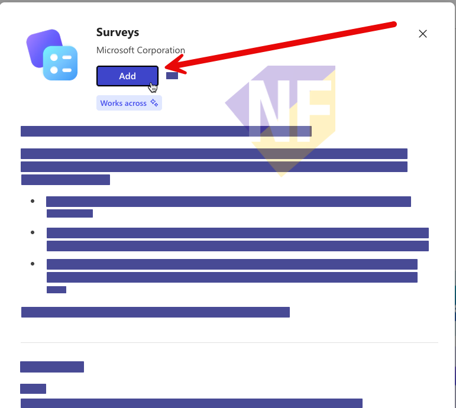

# Exercise: ทดลองใช้ Surveys Agent จาก Agent Store

## Exercise Overview

Agenda เรียกกิจกรรมนี้ว่า Form Agent ส่วนชื่อปัจจุบันใน Microsoft 365 Copilot คือ **Surveys Agent** เราจะเพิ่ม Agent จาก Agent Store สร้างแบบสำรวจ ตรวจคำถาม และดูแผนการส่งภายใน 15 นาที

## Prerequisites

1. มี Microsoft 365 Copilot license
2. องค์กรอนุญาตให้ติดตั้ง Surveys Agent
3. ลงชื่อเข้าใช้ [Microsoft 365 Copilot](https://m365copilot.com/) ด้วยบัญชีองค์กร

> หากองค์กรปิดการติดตั้ง Agent ให้ดูการสาธิตจากผู้สอนและข้ามการกดส่งแบบสำรวจ

## Scenario 1: สร้างแบบสำรวจความพึงพอใจของพนักงาน

### Practice 1: เพิ่ม Surveys Agent จาก Agent Store

#### Steps

1. เลือก **All agents** จากเมนูด้านซ้าย
2. ค้นหา **Surveys Agent** ในหมวด **Built by Microsoft** หรือเปิด [ลิงก์ติดตั้ง Surveys Agent](https://aka.ms/GetSurveysAgent)
3. เลือก **Add agent**



4. ตรวจสอบว่า **Surveys** ปรากฏใต้หัวข้อ **Agents**

### Practice 2: สร้างและตรวจแบบสำรวจ

#### Steps

1. เลือก **Surveys** จากเมนู **Agents**
2. วาง prompt ด้านล่าง แล้วกด **Send**

```text
Help me create an employee satisfaction survey about workplace benefits and work environment.
Keep it to 8 questions and include a mix of rating, multiple-choice, and open-text questions.
```

3. คลิกตรวจคำถามใน Preview แบบ side-by-side
4. ทดสอบ prompt คำสั่งเพื่อส่ง Surveys ให้ผู้รับโดยใช้ email address ของเราเอง (เพื่อให้สะดวกต่อการตรวจสอบ) เช่น

```text
send this survey to [email] for collecting responses and following up.
```

5. รอจนกว่า Agent จะยืนยันการส่งแบบสำรวจ

### Practice 3: ตรวจแผนการส่งแบบสำรวจ

#### Steps

1. เปิดไปยัง inbox ของ email address ที่ใช้ส่งแบบสำรวจ 
2. เช็ค email ที่ได้รับจาก Surveys Agent 
3. คลิกเพื่อเปิด Survey ที่ agent ส่งมา

## Checkpoint

- Surveys Agent ถูกเพิ่มจากหมวด **Built by Microsoft**
- Preview มีคำถามครอบคลุม
- แผนการส่งระบุช่องทางและช่วงเวลาติดตามผล

## Expected Output

- แบบสำรวจฉบับ Preview 1 ชุด และแผนการส่ง 1 ชุด


> อ้างอิง: [Get started with Surveys Agent in Microsoft 365 Copilot](https://support.microsoft.com/en-us/topic/get-started-with-surveys-agent-in-microsoft-365-copilot-ddad28f2-386b-4f81-8a07-8ac4ee8f6bd8)

