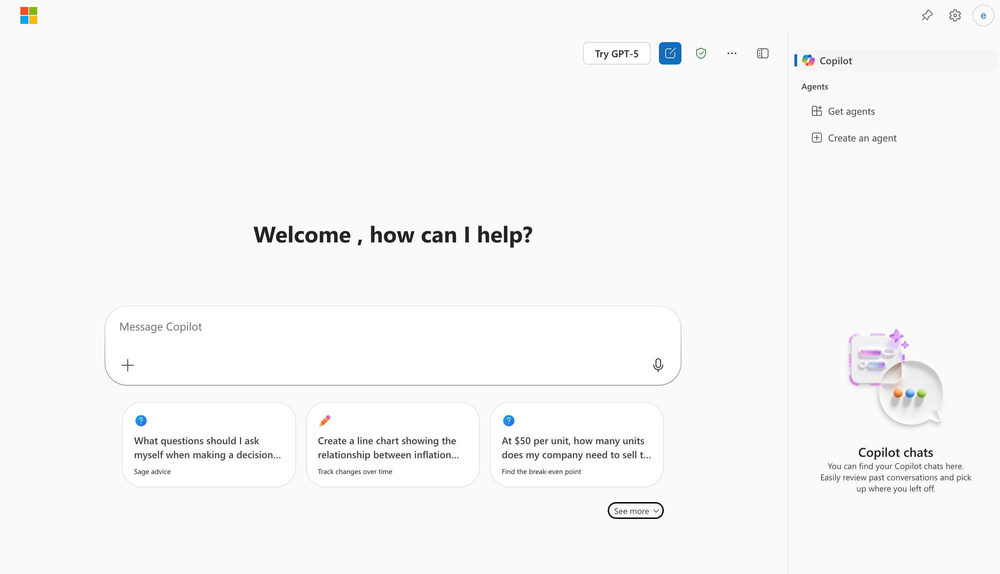
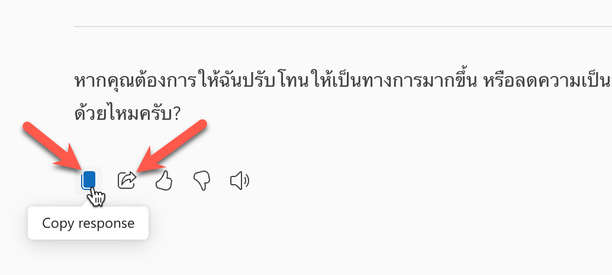
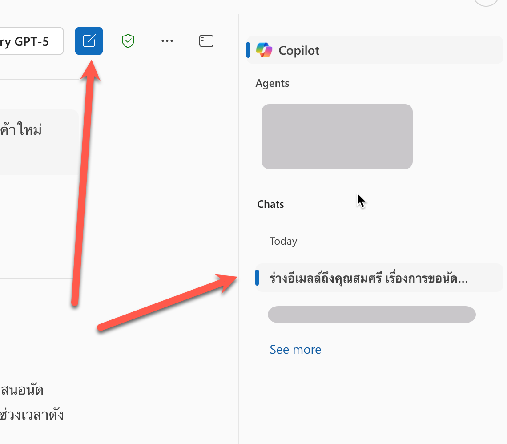
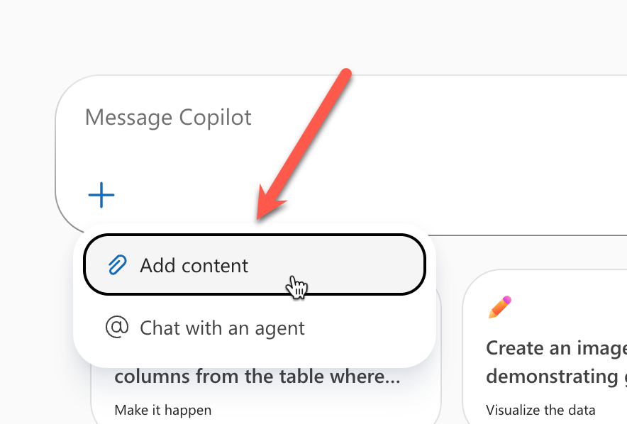
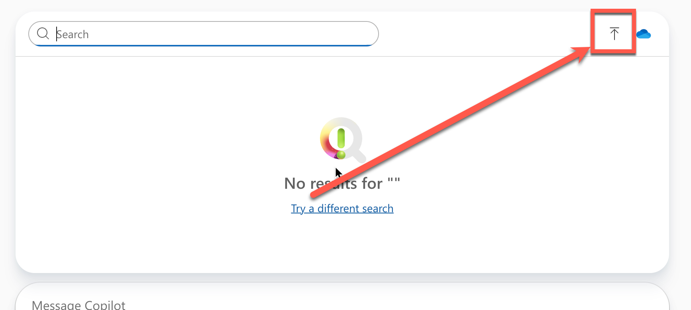
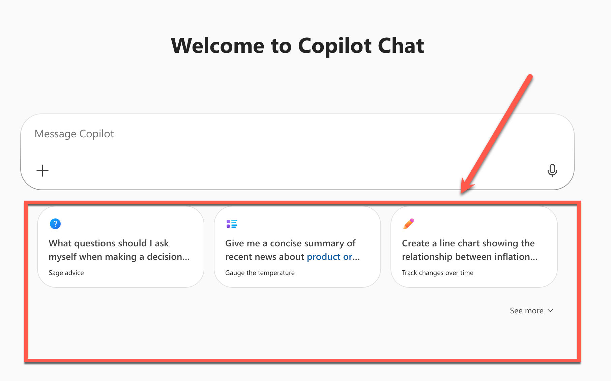

# Part 2: Copilot Chat


## ขั้นตอนการเข้าใช้งาน

1. เปิด link https://m365copilot.com/
   - หรือ https://copilot.microsoft.com
2. Login ด้วย Microsoft account ขององค์กร
3. เราจะเห็นเข้ามาที่ Copilot Chat ตามภาพ




### เช็คก่อน เราใช้ Copilot แบบ free หรือแบบ license

- **สำหรับคนที่ใช้ Copilot แบบมี license** จะมีให้เลือกโหมด **Work | Web** ที่ต้องเลือกให้เหมาะสมนะครับ ซึ่งการใช้งานในส่วนนี้ **จะใช้เป็นโหมด Web** 


- สำหรับคนที่ใช้ Copilot แบบ free จะไม่มีให้เลือก ซึ่งจะใช้ได้แค่โหมด **Web** เท่านั้น

> ในบางกรณี อาจจะเห็นเมนูสลับข้างกับภาพตัวอย่าง แต่องค์ประกอบอยู่ครบก็โอเค


## Feature 1: การร่างอีเมลล์

1. เปิด link https://m365copilot.com/ 
2. คัดลอกข้อความด้านล่างไปใส่ในช่อง Chat โดยแก้ไข `[name]` เป็นชื่อของผู้รับ และ `[topic]` เป็นหัวข้อที่ต้องการพูดคุย

```
Draft an email to [name] about [topic].
```

ตัวอย่าง

```
ร่างอีเมลล์ถึงคุณสมศรี เรื่องการขอนัดคุยเรื่องงบประมาณโครงการสินค้าใหม่ โดยอยากนัดเวลา 10.00 น.
```

3. กด enter หรือกดส่ง (>)
4. ตรวจสอบผลลัพธ์ 
5. ทดสอบปรับสำนวนของแบบร่างอีเมลล์ โดยการคัดลอกข้อความด้านล่างไปใส่ในช่อง Chat

```
ปรับสำนวนให้เป็นทางการ และสุภาพ กระชับ และใส่เบอร์ติดต่อเป็น 02-123-4567
```

6. ตรวจสอบผลลัพธ์ 
7. ใช้ prompt ด้านล่างเพื่อปรับแต่งข้อความให้ง่ายต่อการนำไปใช้งาน

```
ตัดเนื้อหาให้เหลือแค่เนื้อความ email
```

7. ตรวจสอบผลลัพธ์ 
8. กดปุ่มด้านล่างข้อความผลลัพธ์ เพื่อคัดลอกข้อความไปใช้



9. ทดสอบกดปุ่มแชร์ด้านข้าง และส่งให้เพื่อนเพื่อเปิดดูใช้งาน 

## Feature 2: Chat History 

1. จากหน้าจอปัจจุบันให้สังเกตด้านข้างที่มีการแสดงประวัติการสนทนา ซึ่งเราสามารถคลิกเพื่อดูรายละเอียดของการสนทนาก่อนหน้าได้
2. กดปุ่มสร้าง Chat ใหม่ด้านบน เพื่อขึ้นการสนทนาใหม่



3. คัดลอกข้อความด้่านล่างไปใส่ในช่อง Chat 

```
หาข่าว [องค์กร] ที่สำคัญในปี 2025
```

4. ตรวจสอบผลลัพธ์ 

## Feature 3: Working with File

1. ดาวน์โหลดไฟล์ PDF จาก [ที่นี่](https://github.com/teerasej/ai-for-everyone/blob/main/files/Expenses_Policy.pdf) หรือใช้ file ที่ได้จาก zip ที่ดาวน์โหลดตอนแรก
2. ขึ้นห้องแชทใหม่
3. จากกล่องข้อความแชท ให้กดปุ่ม "+" และเลือก Add Content 



3. กดปุ่มเพื่อ upload ไฟล์ 



4. พิมพ์ข้อความต่อจากชื่อไฟล์ที่อัพโหลดตามด้านล่าง

```
งบอะไรเบิกได้เยอะสุด 
```

5. ตรวจสอบผลลัพธ์
6. คัดลอกข้อความด้านล่างเพื่อไป prompt ใช้งานต่อ

```
ขอทราบค่าใช้จ่ายเป็นเงินบาท
```

7. ตรวจสอบผลลัพธ์

> เคล็ดลับ: ในที่นี้ถ้าเรามีไฟล์บน onedrive จะเห็นว่า เราสามารถกดเปิดไฟล์จาก onedrive ได้ด้วย

## Feature 4: สร้างรูปภาพเพื่อนำไปใช้งาน 

1. ขึ้นห้องแชทใหม่
2. คัดลอกข้อความด้านล่างไปใส่ในช่อง Chat และส่งข้อความ

```
สร้างรูปภาพของวิศวกรที่ทำการซ่อมเครื่องจักร
```

3. ตรวจสอบผลลัพธ์
4. คัดลอกข้อความด้านล่างไปใส่ในช่อง Chat และส่งข้อความ เพื่อปรับแต่งรูป

```
ปรับแต่งรูปภาพให้มีพื้นหลังเป็นสีฟ้า และเปลี่ยนเครื่องจักรเป็นรถยนต์
```

5. ตรวจสอบผลลัพธ์

```
ปรับภาพเป็นโทนการ์ตูน
```

6. ตรวจสอบผลลัพธ์
7. บันทึกรูปภาพไปใช้งาน

## Feature 5: Prompt Gallery 

> ส่วนการเปิด prompt gallery อาจจะแตกต่างไปตามประเภทของ user ที่ใช้งาน แต่การเข้าถึง มักจะสามารถทำได้จากปุ่มที่อยู่รอบๆ ช่องข้อความแชทนะ

1. จากช่องข้อความแชท ให้สังเกตปุ่ม Prompt Gallery 
2. กดเปิด Prompt Gallery และสำรวจตัวอย่าง prompt 
3. กดเลือก prompt ที่ต้องการ
4. ตรวจสอบผลลัพธ์




