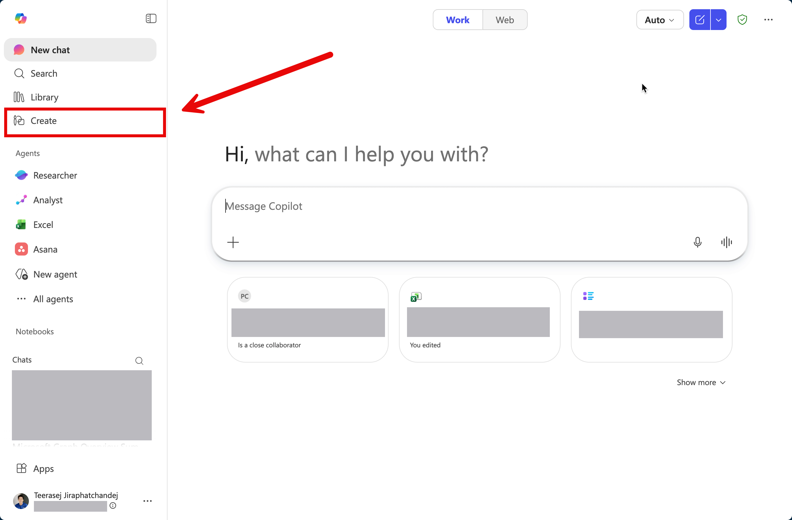
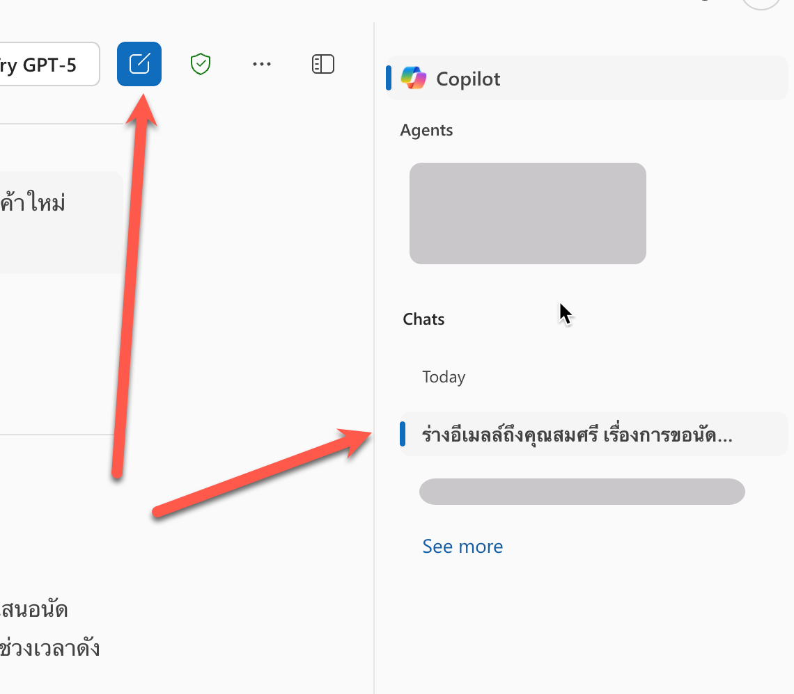

# Exercise: เริ่มต้นใช้ Copilot Chat แบบ Web-grounded

## Exercise Overview

เราจะใช้ Copilot Chat เพื่อร่างข้อความ ค้นข้อมูลจาก Web และทำงานกับไฟล์ที่แนบ โดยฝึกตรวจสอบคำตอบก่อนนำไปใช้งาน

## Prerequisites

1. ลงชื่อเข้าใช้ [Microsoft 365 Copilot](https://m365copilot.com/) ด้วยบัญชีองค์กร
2. ดาวน์โหลด `Expenses_Policy.pdf` จากชุดไฟล์ workshop ไว้ในเครื่อง
3. หากหน้าจอมีปุ่ม **Work IQ** ให้ปิดปุ่มนี้สำหรับกิจกรรม Web-grounded

> Copilot Chat แบบ Basic ใช้ข้อมูลจาก Web เป็นพื้นฐาน หากต้องการใช้ข้อมูลองค์กรในกิจกรรมนี้ เราต้องแนบไฟล์หรือวางข้อมูลลงใน prompt โดยตรง



## Scenario 1: ใช้ Copilot Chat ช่วยงานประจำวัน

## Practice 1: ร่างและปรับ Email

#### Steps

1. เปิด Chat ใหม่
2. วาง prompt ด้านล่าง แล้วกด **Send**

```text
ร่าง Email ภาษาไทยถึงคุณสมศรีเพื่อขอนัดคุยเรื่องงบประมาณโครงการสินค้าใหม่ เวลา 10.00 น.
ใช้โทนสุภาพและเป็นมืออาชีพ ความยาวไม่เกิน 120 คำ
หากข้อมูลสำคัญไม่ครบ ให้ใส่ [ต้องระบุ] แทนการคาดเดา
```

3. ตรวจแบบร่าง แล้วถามต่อเพื่อปรับรูปแบบ

```text
ปรับแบบร่างให้กระชับขึ้น
จัดเป็นหัวข้อ: วัตถุประสงค์ วันที่และเวลา สิ่งที่ต้องเตรียม และช่องทางตอบกลับ
```

4. เปรียบเทียบคำตอบทั้งสองรอบ แล้วคัดลอกฉบับที่เหมาะสม


## Practice 2: ค้นข้อมูลจาก Web และกลับมาที่ Chat History

#### Steps

1. เปิด Chat ใหม่
2. แทนที่ `[องค์กร]` ด้วยชื่อองค์กรที่ต้องการศึกษา แล้วส่ง prompt

```text
ค้นหาข่าวสำคัญเกี่ยวกับ [องค์กร] ที่เผยแพร่ในปี 2026
สรุป 3 เรื่อง โดยใส่วันที่ แหล่งที่มา และ link สำหรับตรวจสอบ
แยกข้อเท็จจริงออกจากความคิดเห็น
```

3. เปิดแหล่งที่มาอย่างน้อย 1 รายการ และตรวจวันที่กับเนื้อหาต้นฉบับ
4. เลือก Chat ก่อนหน้าจาก **Chat History** เพื่อกลับไปดูแบบร่าง Email



## Practice 3: Working with File

#### Steps

1. เปิด Chat ใหม่
2. เลือกปุ่ม **+** แล้วเลือก **Upload images or files**
3. อัพโหลด `Expenses_Policy.pdf`


4. วาง prompt ด้านล่าง แล้วกด **Send**

```text
จากไฟล์ที่แนบมา สรุปค่าใช้จ่ายที่เบิกได้สูงสุด 3 ประเภท
จัดเป็นตาราง: ประเภทค่าใช้จ่าย | วงเงิน | เงื่อนไข | หน้าหรือหัวข้ออ้างอิง
หากข้อมูลไม่ปรากฏในไฟล์ ให้ระบุว่า "ไม่พบข้อมูล"
```

5. เปิดไฟล์ต้นทางและตรวจวงเงินอย่างน้อย 2 รายการ

> File upload ใน Copilot Chat แบบ Basic เป็น standard access และอาจมีข้อจำกัดตามความพร้อมของบริการ

## Checkpoint

- แบบร่าง Email ไม่มีข้อมูลที่ Copilot คาดเดาแทนเรา
- ข่าวจาก Web มีวันที่ แหล่งที่มา และ link ที่เปิดตรวจสอบได้
- ตารางค่าใช้จ่ายอ้างอิงข้อมูลจาก `Expenses_Policy.pdf`

## Expected Output

- แบบร่าง Email ที่ปรับแล้ว 1 ฉบับ
- สรุปข่าวพร้อมแหล่งอ้างอิง 3 เรื่อง
- ตารางค่าใช้จ่ายจากไฟล์ 1 ตาราง


