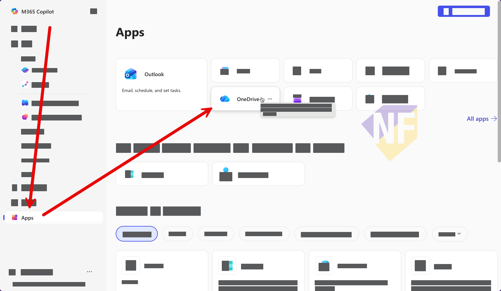

# อัพโหลดไฟล์เข้า OneDrive

## 1. ล๊อคอินเข้าใช้งาน OneDrive

วิธีที่ 1:[https://onedrive.live.com/](https://onedrive.live.com/)
  
วิธีที่ 2: เข้าใช้งานผ่านทาง https://office.com > เลือกเมนู **App** จากทางด้านซ้าย แล้วเลือก OneDrive
   

## 2. สร้าง folder ใหม่ชื่อ **MyCopilot** จากการกดปุ่ม **Create or upload > Folder**
   

## 3. อัพโหลดไฟล์ที่เตรียมไว้ทั้งหมดจาก zip file ที่แตกออกมา ไปที่ OneDrive 
   