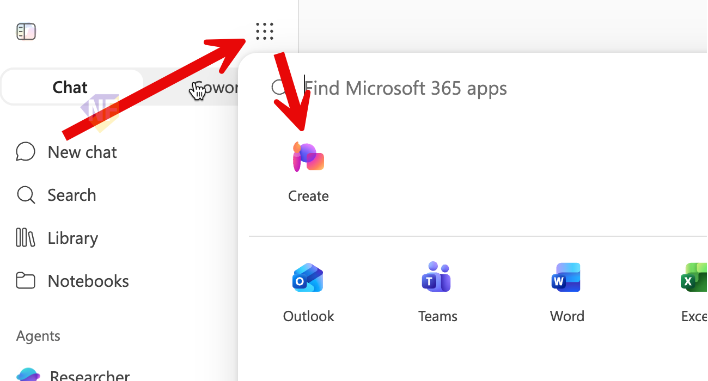

# Exercise: สรุปงานและเตรียมประชุมด้วย Work IQ

## Exercise Overview

แบบฝึกหัดนี้ให้เราฝึกใช้ Copilot Chat ที่เปิด **Work IQ** เพื่อสรุปข้อมูลจากงานของเรา เตรียมตัวสำหรับการประชุม และวิเคราะห์ข้อมูลจากไฟล์ Excel 

## Prerequisites

1. ลงชื่อเข้าใช้ [Microsoft 365 Copilot](https://m365copilot.com/) ด้วยบัญชีองค์กรที่มี Microsoft 365 Copilot license
2. ให้แน่ใจว่าได้อัพโหลดไฟล์ `Business Idea.docx` และ `sample_product_revenue.xlsx` ไปยัง OneDrive แล้ว หากยังไม่มีไฟล์ ให้ดาวน์โหลดไฟล์ zip สำหรับเวิร์คชอปได้ที่ [Download workshop files](https://raw.githubusercontent.com/teerasej/ai-for-everyone/unilever-1/files/Exercise_file.zip)
3. ตรวจสอบว่าปุ่ม **Work IQ** อยู่ในสถานะเปิด เพื่อให้ Copilot อ้างอิงข้อมูลที่บัญชีของเราเข้าถึงได้


## Scenario 1: เตรียมข้อมูลให้พร้อมก่อนเริ่มงาน

เราจะใช้ข้อมูลจากไฟล์ การนัดหมาย และข้อมูลใน Microsoft 365 เพื่อสร้างสรุปที่ตรวจสอบแหล่งอ้างอิงได้

## Practice 1: ค้นข้อมูลจาก Web และกลับมาที่ Chat History

#### Steps

1. เปิด Chat ใหม่
2. ใช้ prompt ด้านล่างเพื่อให้ copilot ค้นหาข้อมูลสินค้าของคู่แข่งจาก Web และสรุปเป็นตาราง

```text
สืบค้นข้อมูลสินค้าแชมพูคู่แข่ง
ตัวอย่างสินค้า: Klorane Shampoo with Quinine and Organic Edelweiss หรือแชมพูเฉพาะทางจากยุโรปที่มีข้อมูลออนไลน์น่าเชื่อถือ

สรุปเป็นตาราง 5 คอลัมน์:
ชื่อสินค้า | ประเทศหรือภูมิภาคที่จำหน่าย | จุดขายหรือ claim หลัก | ราคา/ขนาดบรรจุภัณฑ์ที่พบ | แหล่งที่มาและ link

ขอข้อมูลอย่างน้อย 3 แหล่ง โดยเน้นเว็บไซต์ทางการ ร้านค้าปลีกที่น่าเชื่อถือ หรือรีวิวจากแหล่งที่ตรวจสอบได้
แยก “ข้อเท็จจริงจากแหล่งที่มา” ออกจาก “ข้อสังเกต/ข้อคิดเห็น”
หากไม่พบราคา ขนาด หรือประเทศที่จำหน่าย ให้ระบุว่า "ไม่พบข้อมูล"
```

3. เปิดแหล่งที่มาอย่างน้อย 1 รายการ และตรวจวันที่กับเนื้อหาต้นฉบับ
4. เลือก Chat ก่อนหน้าจาก **Chat History** เพื่อกลับไปดูแบบร่าง Email


### Practice 2: สรุปข้อมูลจากไฟล์สำหรับการประชุม 

#### Steps

1. เปิด [Microsoft 365 Copilot](https://m365copilot.com/)
2. เปิด **Work IQ**
3. วาง prompt ด้านล่างในช่อง Chat

    ```text
    สรุปข้อมูลจากไฟล์ / เพื่อใช้เตรียมการประชุม
    จัดคำตอบเป็น 3 ส่วน:
    1. เป้าหมายของแนวคิดธุรกิจ
    2. ประเด็นที่ต้องตัดสินใจ
    3. คำถามที่ควรถามในที่ประชุม
    ใช้ภาษาไทยแบบกระชับ และไม่เพิ่มข้อมูลที่ไม่มีในไฟล์
    ```

4. พิมพ์ `/` หลังคำว่า `ไฟล์` แล้วเลือก `Business Idea.docx` จาก OneDrive
   
    > ในกรณีที่เราใช้วิธีการอัพโหลดไฟล์เอง ให้เลือกปุ่ม **+** แล้วเลือก **Upload images or files** เพื่ออัพโหลดไฟล์ `Business Idea.docx` จากเครื่องของเรา
    > และใช้ prompt เดิมด้านบนเพื่อสรุปข้อมูลจากไฟล์ โดยไม่ต้องใส่ "/" ก่อนชื่อไฟล์

5. กด **Send** และรอให้ Copilot สร้างคำตอบ
6. เปิดแหล่งอ้างอิงในคำตอบอย่างน้อย 1 รายการ แล้วเปรียบเทียบกับข้อมูลในไฟล์


### Practice 3: เตรียมตัวสำหรับการประชุมในสัปดาห์นี้ 

#### Steps

1. เริ่ม Chat ใหม่ และตรวจสอบว่า **Work IQ** ยังเปิดอยู่
2. วาง prompt ด้านล่าง แล้วกด **Send**
3. ตรวจสอบรายชื่อการประชุม วัน เวลา และไฟล์ที่ Copilot แนะนำ
4. เลือกการประชุม 1 รายการ แล้วถามต่อเพื่อสร้าง checklist สำหรับเตรียมตัว

```text
แสดงการประชุมที่เกี่ยวข้องกับเราในสัปดาห์นี้
เลือก 1 การประชุมที่ควรเตรียมตัวมากที่สุด แล้วสรุป:
- เป้าหมายของการประชุม
- ผู้เข้าร่วมที่เกี่ยวข้อง
- ไฟล์หรือ Email ที่ควรอ่านก่อนประชุม
- คำถาม 3 ข้อที่ควรเตรียม
อ้างอิงเฉพาะข้อมูลที่บัญชีของเราเข้าถึงได้
```

> หากบัญชีไม่มีการประชุมในสัปดาห์นี้ ให้เปลี่ยนช่วงเวลาใน prompt เป็น**สัปดาห์หน้า** หรือ **สัปดาห์ที่แล้ว** เพื่อให้ Copilot แสดงการประชุมที่เกี่ยวข้องกับเราแทน

### Practice 4: วิเคราะห์ข้อมูลเพื่อเตรียมประเด็นตัดสินใจ 

#### Steps

1. เริ่ม Chat ใหม่ และตรวจสอบว่า **Work IQ** ยังเปิดอยู่
2. วาง prompt ด้านล่างในช่อง Chat
3. พิมพ์ `/` หลังคำว่า `ไฟล์` แล้วเลือก `sample_product_revenue.xlsx`
4. กด **Send** และตรวจสอบว่าคำตอบอ้างอิงข้อมูลจากไฟล์ที่เลือก
5. เปรียบเทียบตัวเลขสำคัญในคำตอบกับข้อมูลใน workbook อย่างน้อย 2 จุด

```text
วิเคราะห์ข้อมูลจากไฟล์ / เพื่อเตรียมประเด็นสำหรับผู้บริหาร
สรุปเป็นตารางที่มีคอลัมน์: ประเด็น | หลักฐานจากข้อมูล | ผลกระทบ | ข้อเสนอแนะ
ระบุแนวโน้มที่สำคัญ 2 ข้อ ความผิดปกติ 1 ข้อ และคำถามที่ควรตรวจสอบต่อ 2 ข้อ
ห้ามคาดเดาตัวเลขที่ไม่มีในไฟล์
```

## Practice 5: สร้าง Infographic ด้วย Copilot Create

1. กดเลือกเมนู **Create** ที่ซ่อนอยู่ด้านบนของเมนู 



2. จากรายการไอเดียด้านบน ให้เลือก **Create an Image**
3. ในช่อง Prompt Box ให้ copy prompt ด้านล่างไปวาง เพื่อใช้กำหนดเนื้อหาของรูปภาพ
   ```
   Place the character from the reference image into an illustrated corporate meeting room with the character presenting ideas to an attentive group of investors in pastel colors.
   ```

4. กดปุ่ม **+ Add Content** ด้านล่างซ้าย ของ Prompt box > เลือก **Add an Image** > เลือกไฟล์รูปภาพ **character.png** ที่ได้จากไฟล์ zip ในเวิร์คชอปนี้ 
    
5. ในช่อง **Add Style** ให้เลือก Style รูปที่ต้องการ
6. กดปุ่ม **Create** และรอผลลัพธ์
7. เมื่อได้ผลลัพธ์แล้ว เราสามารถกดที่ภาพเพื่อดูภาพขนาดใหญ่ขึ้น หรือกด Download เพื่อดาวน์โหลดภาพได้


## Checkpoint

- **Work IQ** เปิดอยู่ตลอดทุก Practice ที่ใช้ Work IQ
- คำตอบจาก Practice 2 และ 4 มีแหล่งอ้างอิงที่เปิดตรวจสอบได้
- รายละเอียดการประชุมและตัวเลขสำคัญตรงกับข้อมูลต้นทาง
- ผลการวิเคราะห์แยกข้อเท็จจริง ผลกระทบ และข้อเสนอแนะออกจากกัน

## Expected Output

- สรุปไฟล์สำหรับเตรียมประชุม 1 ชุด
- checklist เตรียมประชุม 1 ชุด
- ตารางวิเคราะห์ข้อมูลที่มีแนวโน้ม ความผิดปกติ และข้อเสนอแนะ 1 ตาราง


