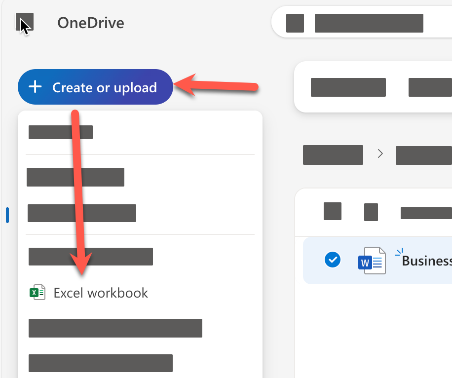
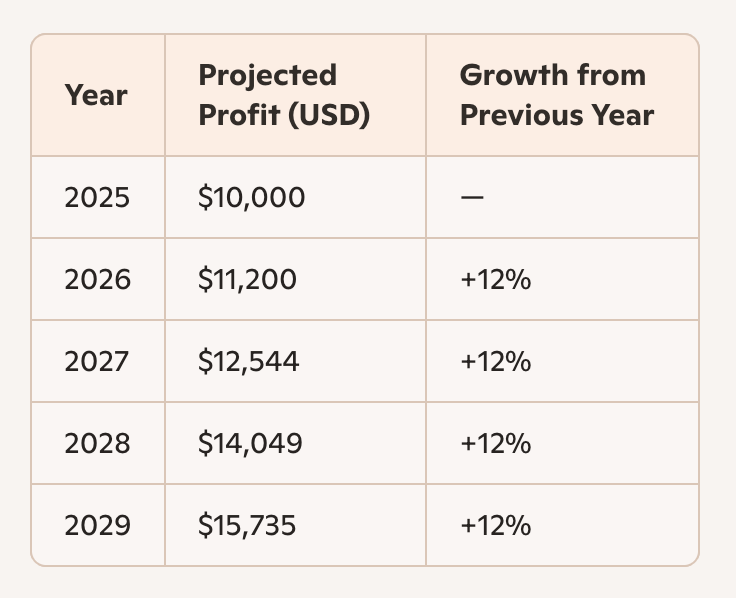

# Feature 4: สร้าง Financial report

> ในแบบฝึกหัดนี้ การใช้งานจะแตกต่างกันตามประเภทของ Account ที่ใช้งาน Copilot นะครับ

1. กลับมาที่ OneDrive ใน folder เดิม
2. ให้ทำการสร้างไฟล์เอกสาร Excel ใหม่
   
3. แบบฝึกหัดนี้ เราจะใช้คำสั่ง prompt ต่อไปนี้สำหรับสั่งงาน copilot

   ```
    Create a table of projected profits for the next 5 years, starting with this year. The profit this year should be 10,000 baht and it should increase by 12% each year.
   ```

   ### สำหรับผู้ใช้ทั่วไป
   1. คัดลอกข้อความ prompt มาใช้กับ Copilot ด้านข้างของโปรแกรมเว็บเบราเซอร์
   2. ตรวจสอบผลลัพธ์
   3. เลือกเฉพาะตัวตาราง
   
   4. ใช้ปุ่มลัด Ctrl + C
   5. คลิกเลือกช่อง cell ใน Excel sheet ให้จำนวนแถวและคอลัมน์ตรงกับตารางที่คัดลอกมา
   6. ใช้ปุ่มลัด Ctrl + V เพื่อวางตารางลงใน Excel sheet
   7. จัดให้เรียบร้อย

   ### สำหรับผู้ใช้ที่มี License
   1. เปิด Copilot จากแถบเมนูด้านบน > ฝั่งขวาสุดของโปรแกรม Excel
   2. คัดลอกข้อความ prompt มาใช้กับ Copilot ใน Excel
   3. ตรวจสอบผลลัพธ์
   4. ถ้ามีปุ่ม insert into new sheet ให้คลิกที่ปุ่มเพื่อเพิ่มตารางลงใน sheet ใหม่
   5. (หรือจะใช้การเลือกตารางจากคำตอบ และวางลงใน sheet ด้วยตัวเองก็ได้)
