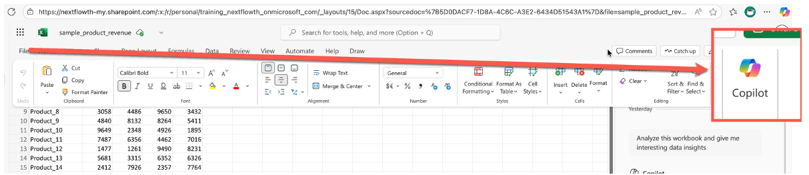

# Exercise: วิเคราะห์ข้อมูลด้วย Copilot in Excel

## Exercise Overview

เราจะใช้ Copilot in Excel สำรวจยอดขาย หา insight สร้างสูตร และสร้างกราฟจาก `sample_product_revenue.xlsx`

## Prerequisites

1. มี Microsoft 365 Copilot license
2. อัพโหลด `sample_product_revenue.xlsx` ไปยัง OneDrive แล้ว
3. หากใช้บัญชีร่วมกัน ให้สร้างสำเนาไฟล์ด้วย **Copy to** และเปลี่ยนชื่อก่อนเริ่ม


## Scenario 1: วิเคราะห์รายได้ของสินค้า

### Practice 1: หา insight และสร้างภาพประกอบการตัดสินใจ (ประมาณ 14 นาที)

#### Steps

1. เปิด `sample_product_revenue.xlsx` ด้วย Excel บน Web
2. จากเมนู **Home** เปิด **Copilot**



3. วาง prompt ด้านล่าง แล้วตรวจสอบ insight กับข้อมูลใน workbook

```text
วิเคราะห์ workbook นี้และสรุป:
- สินค้าที่มีรายได้รวมสูงสุด 3 อันดับ
- แนวโน้มรายได้รายไตรมาสที่น่าสนใจ 2 ข้อ
- ค่าที่ผิดปกติหรือควรตรวจสอบต่อ 1 ข้อ
อ้างอิงชื่อ sheet และข้อมูลที่ใช้ในแต่ละข้อ
```

4. ขอให้ Copilot สร้างกราฟสำหรับเปรียบเทียบสินค้า

```text
สร้าง column chart แสดงสินค้า 5 อันดับแรกตามรายได้รวม และตั้งชื่อกราฟให้สื่อความหมายชัดเจน
```

5. ขอให้ Copilot แนะนำสูตรสำหรับคำนวณสัดส่วนรายได้ของสินค้าแต่ละรายการ

```text
สร้าง formula สำหรับคำนวณรายได้รวมของสินค้าแต่ละรายการเป็นเปอร์เซ็นต์ของรายได้รวมทั้งหมด
อธิบายสูตรสั้น ๆ ก่อนนำไปใช้
```

6. ตรวจสอบช่วงเซลล์ในสูตร แล้วเลือกนำสูตรไปใช้เมื่อข้อมูลถูกต้อง
7. บันทึกไฟล์โดยคงไฟล์ต้นฉบับไว้

## Checkpoint

- insight ทุกข้อสามารถตรวจสอบย้อนกลับจาก workbook ได้
- กราฟแสดงสินค้า 5 อันดับแรกตามรายได้รวม
- สูตรใช้ช่วงเซลล์ถูกต้องและไม่มี error

## Expected Output

- insight อย่างน้อย 3 ข้อ กราฟ 1 รายการ และคอลัมน์เปอร์เซ็นต์รายได้ 1 คอลัมน์
