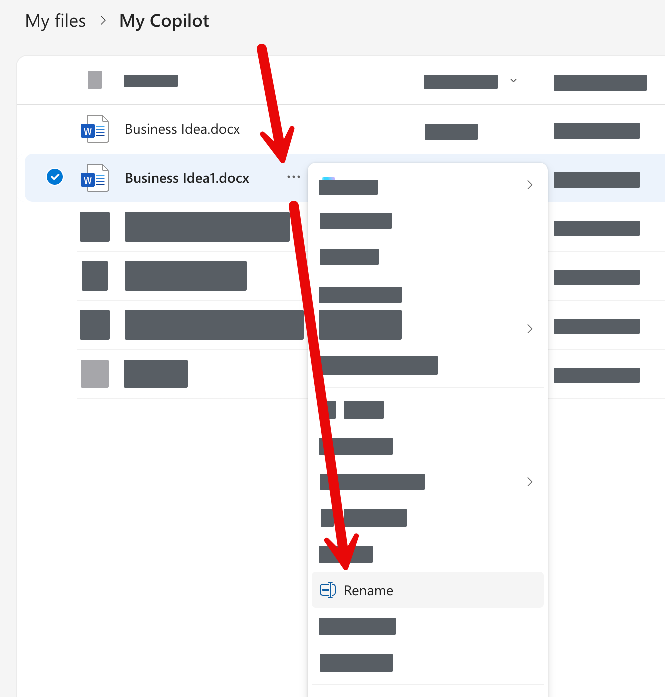
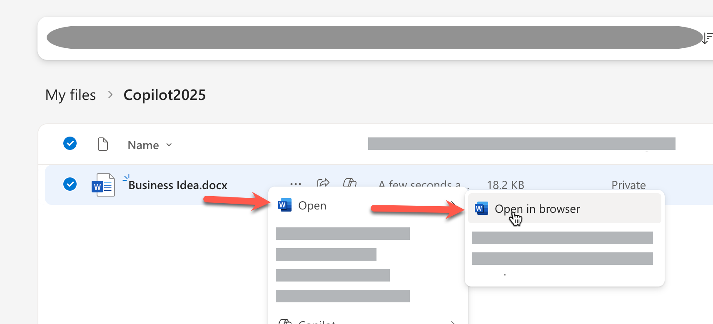
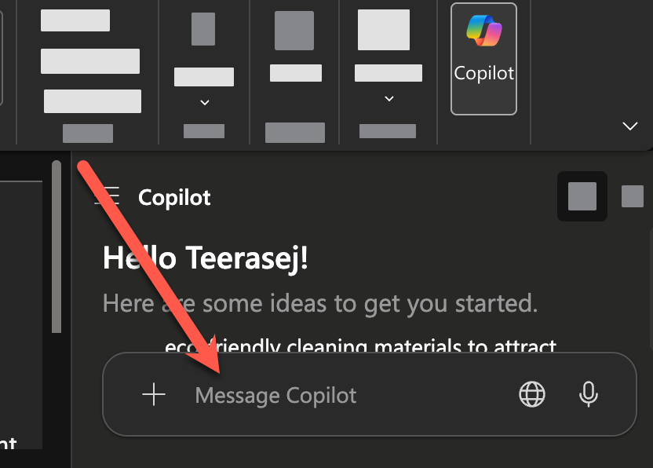

# Feature 1: สรุปเอกสารให้เข้าใจง่าย

> ในแบบฝึกหัดนี้ การใช้งานจะแตกต่างกันตามประเภทของ Account ที่ใช้งาน Copilot นะครับ

## หากพวกเราแชร์ M365 Account กันใช้ ต้องสร้างสำเนาไฟล์ใหม่ก่อนเริ่มทำ Exercise

1. ให้ทำการคลิกขวาที่ไฟล์เอกสารใน OneDrive บนเว็บเบราเซอร์ 
2. แล้วเลือก "Copy To" เพื่อทำสำเนาไฟล์ใหม่


3. คลิกขวาที่ไฟล์สำเนา แล้วเลือกคำสั่ง "Rename" เพื่อเปลี่ยนชื่อไฟล์ให้ต่อชื่อตัวเราห้อยท้าย เพื่อไม่ให้สับสนกับไฟล์ของคนอื่น



## Exercise
1. จาก OneDrive ให้คลิกขวาที่ไฟล์ word บนหน้าเว็บ 
   

2. สั่งให้ Copilot ช่วยสรุปเนื้อหาในเอกสารให้ โดยใช้คำสั่ง prompt ต่อไปนี้
   
   ```
   สรุปเนื้อหาสำคัญในเอกสารนี้เป็น 5 หัวข้อ พร้อมแนะนำขั้นตอนถัดไป
   ```


   ### สำหรับผู้ใช้ที่มี License
   1. กดเปิด Copilot ได้จากด้านบนขวาของแถบเครื่องมือ Microsoft Word
   
   2. คัดลอกและวาง prompt ด้านบน ในห้องแชท และกดปุ่ม enter หรือปุ่มส่ง
   

3. ตรวจสอบผลลัพธ์ที่ได้จาก Copilot
4. กดปุ่ม 