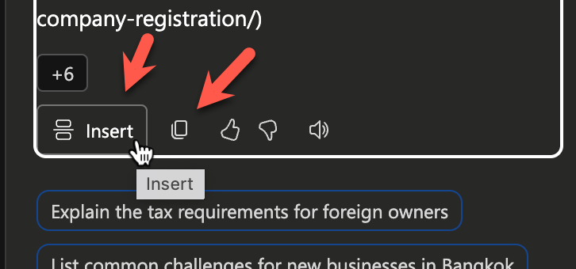
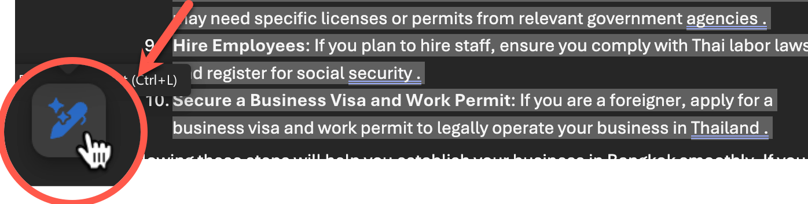
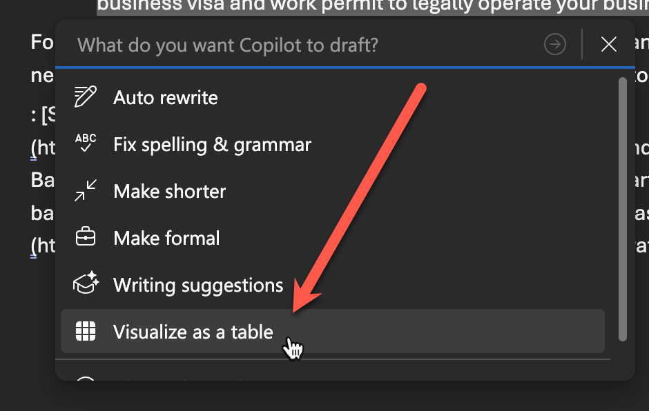

# Feature 2: ให้ออกไอเดีย และแปลงเป็น Table


> ในแบบฝึกหัดนี้ การใช้งานจะแตกต่างกันตามประเภทของ Account ที่ใช้งาน Copilot นะครับ

1. จากหน้าต่างที่เปิดอยู่ สั่งให้ Copilot ช่วยสรุปแนวทางทำธุรกิจใหม่ โดย copy ใช้คำสั่ง prompt ต่อไปนี้ในห้องแชท Copilot
   
   ```
    How do I setup a new business in Bangkok? Answer with a numbered list.
   ```

2. ตรวจสอบผลลัพธ์ที่ได้จาก Copilot
3. นำผลลัพธ์ที่ได้ มาใช้ในเอกสาร

   ### สำหรับผู้ใช้ทั่วไป
   1. กดปุ่ม Copy ด้านล่างของข้อความผลลัพธ์ในห้องแชท
   
   2. วางข้อความไว้ด้านล่างของเนื้อหาเดิมในเอกสาร

   ### สำหรับผู้ใช้ที่มี License
   - กดปุ่ม insert ด้านล่างของข้อความผลลัพธ์ หรือจะกดปุ่ม copy และวางข้อความด้านล่างของเนื้อหาเดิมในเอกสารก็ได้
   

> ขั้นตอนต่อไปนี้จะสามารถทำได้เฉพาะผู้ใช้ที่มี License เท่านั้น

4. เลือกข้อความที่ขึ้นต้นด้วยรายการตัวเลขให้ครบทุกข้อ และกดปุ่มไอคอนรูปปากกาวิเศษด้านล่างซ้ายของข้อความที่เลือก
   
5. เลือกคำสั่ง Visualize as a table
   
6. ตรวจสอบผลลัพธ์ในรูปแบบตาราง
7. กดปุ่ม Keep it เพื่อยืนยันการแสดงผลในรูปแบบตาราง