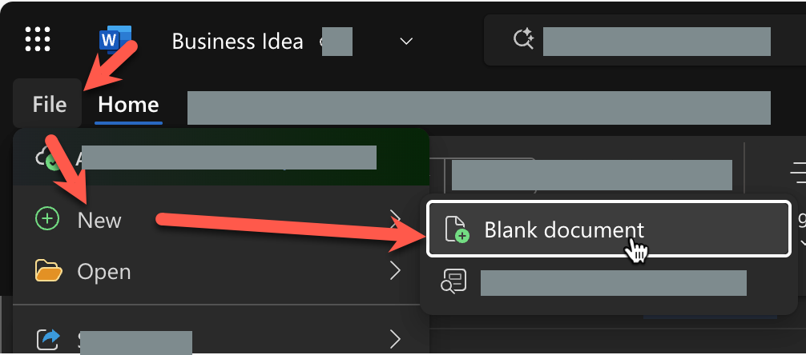
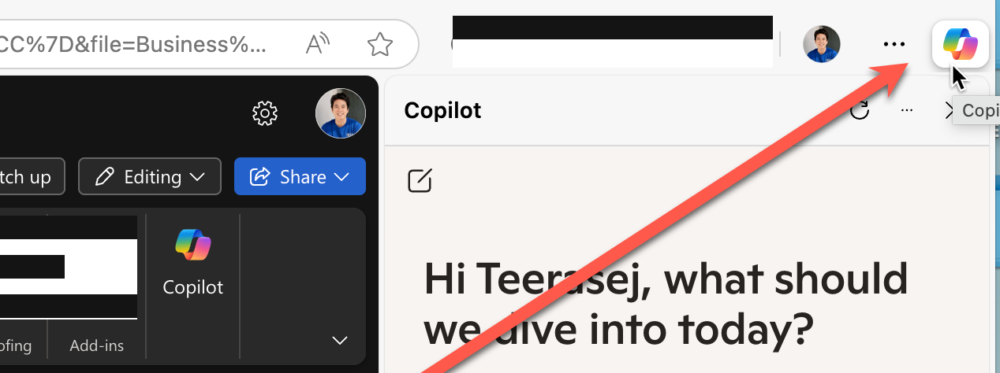
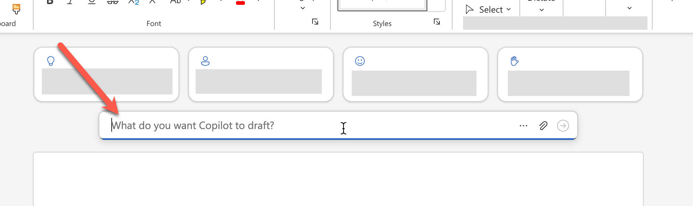

# Feature 3: สร้างแผนธุรกิจ

> ในแบบฝึกหัดนี้ การใช้งานจะแตกต่างกันตามประเภทของ Account ที่ใช้งาน Copilot นะครับ

1. ให้ทำการสร้างไฟล์เอกสาร Word ใหม่
   
2. แบบฝึกหัดนี้ เราจะใช้คำสั่ง prompt ต่อไปนี้สำหรับสั่งงาน copilot

   ```
   Write a business plan for "Contoso Cleaning", a commercial cleaning business in Bangkok. Include an executive summary, market overview, and financial projections.
   ```

   ### สำหรับผู้ใช้ทั่วไป
   1. คัดลอกข้อความ prompt มาใช้กับ Copilot ด้านข้างของโปรแกรมเว็บเบราเซอร์
   
   2. ตรวจสอบผลลัพธ์, กดปุ่มคัดลอก, และวางข้อความในเอกสาร

   ### สำหรับผู้ใช้ที่มี License
   1. ในหน้าเอกสารว่างๆ ให้นำ prompt มาใส่ในช่อง **What do you want copilot to draft?** กลางหน้าเอกสารด้านบน และกด enter หรือปุ่มส่งข้อความ
   
   2. ตรวจสอบผลลัพธ์

