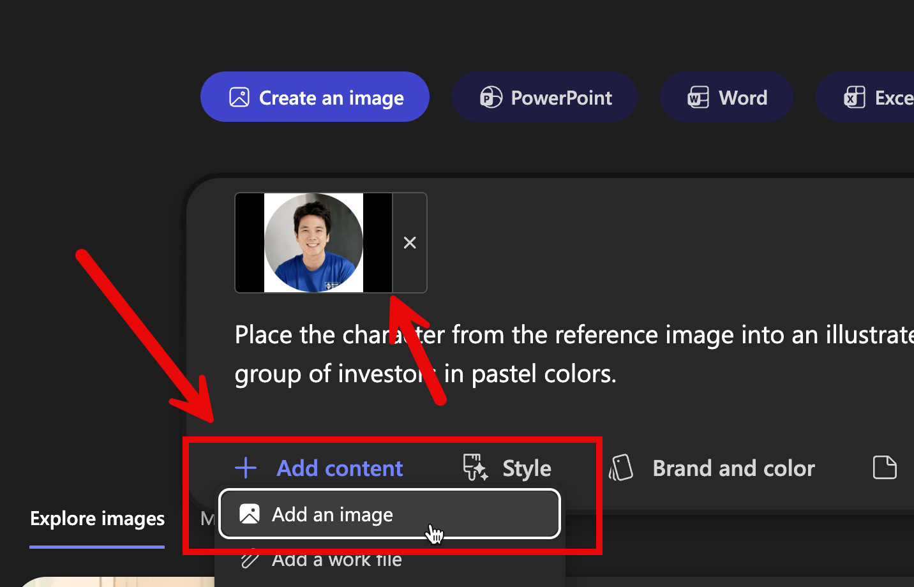

#  Copilot Chat

## Scenario 1: Situation Summary ด้วย Copilot Chat

### Step 1: เปิด Copilot Chat

1. เปิด [Copilot Chat](https://m365.cloud.microsoft/chat) หรือ[ที่นี่](https://office.com)
2. ด้านบนของหน้าจอ chat ให้กดเลือกโหมด **Web** 


### Step 2: Executive Summary - สรุปแบบ What/Why/So what/Now what

เราจะใช้คำสั่ง prompt สำหรับการสรุป Raw note จากหน้างาน เพื่อเรียบเรียงให้เข้าใจสถานการณ์ และสรุปรายการแก่หัวหน้าระดับสูงได้ 

1. ก๊อปปี้ prompt ข้างล่างนี้ไปวางในช่องแชท

```
จากข้อมูลนี้ ช่วยสรุปให้ผู้บริหารในรูปแบบ
1) What happened (เกิดอะไรขึ้น)
2) Why (สาเหตุที่เป็นไปได้)
3) So what (ผลกระทบต่อธุรกิจ/ลูกค้า/ต้นทุน)
4) Now what (ข้อเสนอแนะ 3 ข้อ + owner)
ให้ตอบเป็นภาษาไทย กระชับ เป็น bullet points

---
```

2. จากนั้น copy ข้อความด้านล่างที่เป็น Raw note จากหัวหน้างานไปวางไว้ด้านล่าง

```
• ช่วงวันที่: 1–28 ก.พ. 2026 (ข้อมูลรวม 4 DC: บางบัวทอง, ลาดกระบัง, เชียงใหม่, ขอนแก่น)
• ประเด็นหลัก: 1) ตรงเวลา (On-time) ลดลงที่ DC-บางบัวทอง 2 วัน (10 และ 18 ก.พ.) สาเหตุคาดว่าเกิดจากรถขนส่งไม่พอ + คอขวดจุดคัดแยก
• OT พุ่งที่ DC-บางบัวทองในวันเดียวกัน (เพิ่มกำลังคนชั่วคราว)
• DC-เชียงใหม่มี Fill rate ลดลง 2 ครั้ง (7 และ 21 ก.พ.) สาเหตุจากสินค้าเข้าไม่ตามแผน + vendor lead time ยืด
• เหตุการณ์ความปลอดภัย: มี near-miss 3 ครั้ง (ยกของหนัก/ทางเดินแคบ) และ incident 2 ครั้ง (รถโฟล์คลิฟต์เฉี่ยวชั้นวาง)
• ข้อเสนอเบื้องต้น: เพิ่มรอบรับสินค้าช่วง 9:00–11:00, ปรับ route รถขนส่งช่วง peak, และทำ 5S ทางเดินโซนคัดแยก
```
3. กดปุ่มส่ง และรอตรวจสอบที่ Copilot สรุปสถานการณ์ให้เรา

### Step 3: ขอ "เวอร์ชันสำหรับผู้บริหาร" ที่กระชับ

ก๊อปปี้ prompt ข้างล่างนี้ไปวางในช่องแชท ในการคุยต่อเนื่อง และขอให้สรุปแบบย่อสำหรับผู้บริหารที่ต้องการข้อมูลสั้นๆ เพื่อการตัดสินใจทันที

```
ย่อคำตอบข้างต้นให้เหลือ 5 ข้อสั้นๆ ที่ผู้บริหารอ่านแล้วตัดสินใจได้ทันที
```

## Scenario 2: สรุปงานที่เกิดในสัปดาห์ที่แล้ว และเตรียมงานต่อในสัปดาห์นี้

1. เปิด [Copilot Chat](https://m365.cloud.microsoft/chat) หรือ[ที่นี่](https://office.com)
2. ด้านบนของหน้าจอ chat ให้กดเลือกโหมด **Work** (ด้านซ้าย)


3. ก๊อปปี้ prompt ข้างล่างนี้ไปวางในช่องแชท และกดส่ง พร้อมสังเกตผลลัพธ์ที่ได้

```
สรุปความคืบหน้าของงานในสัปดาห์ที่แล้ว
```

4. ก๊อปปี้ prompt ข้างล่างนี้ไปวางในช่องแชท และกดส่ง พร้อมสังเกตผลลัพธ์ที่ได้

```
มีนัดหมาย meeting อะไรบ้างในสัปดาห์นี้ 
แนะนำขั้นตอนที่จำเป็นต้องทำก่อนเข้าแต่ละ meeting
และแนะนำไฟล์ที่สามารถใช้เตรียมตัวสำหรับ meeting เหล่านั้น
```

## Scenario 3: สร้าง Infographic ด้วย Copilot Create

1. กดเลือกเมนู Create


2. จากรายการไอเดียด้านบน ให้เลือก **Create an Image**
3. ในช่อง Prompt Box ให้ copy prompt ด้านล่างไปวาง เพื่อใช้กำหนดเนื้อหาของรูปภาพ
   ```
   Place the character from the reference image into an illustrated corporate meeting room with the character presenting ideas to an attentive group of investors in pastel colors.
   ```

4. กดปุ่ม **+ Add Content** ด้านล่างซ้าย ของ Prompt box > เลือก **Add an Image** > เลือกไฟล์รูปภาพ **character.png** ที่ได้จากไฟล์ zip ในเวิร์คชอปนี้ 
    
5. ในช่อง **Add Style** ให้เลือก Style รูปที่ต้องการ
6. กดปุ่ม **Create** และรอผลลัพธ์
7. เมื่อได้ผลลัพธ์แล้ว เราสามารถกดที่ภาพเพื่อดูภาพขนาดใหญ่ขึ้น หรือกด Download เพื่อดาวน์โหลดภาพได้
