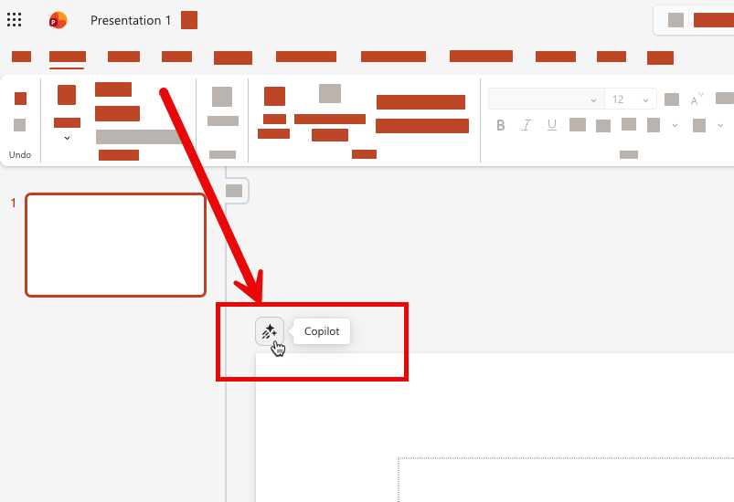
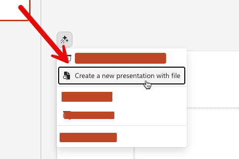
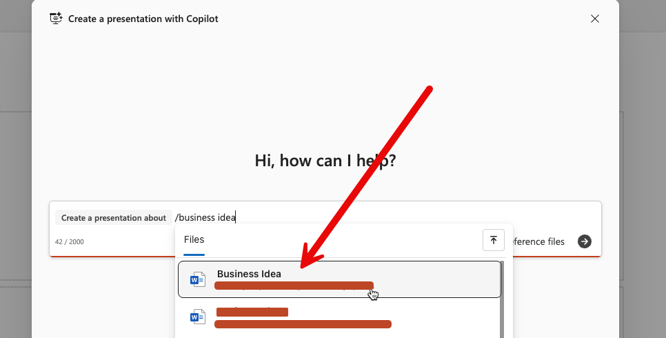
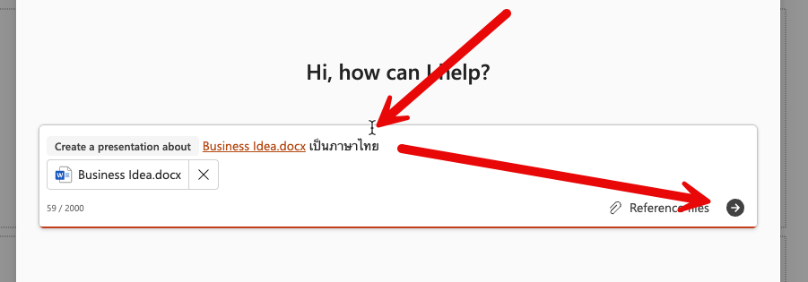
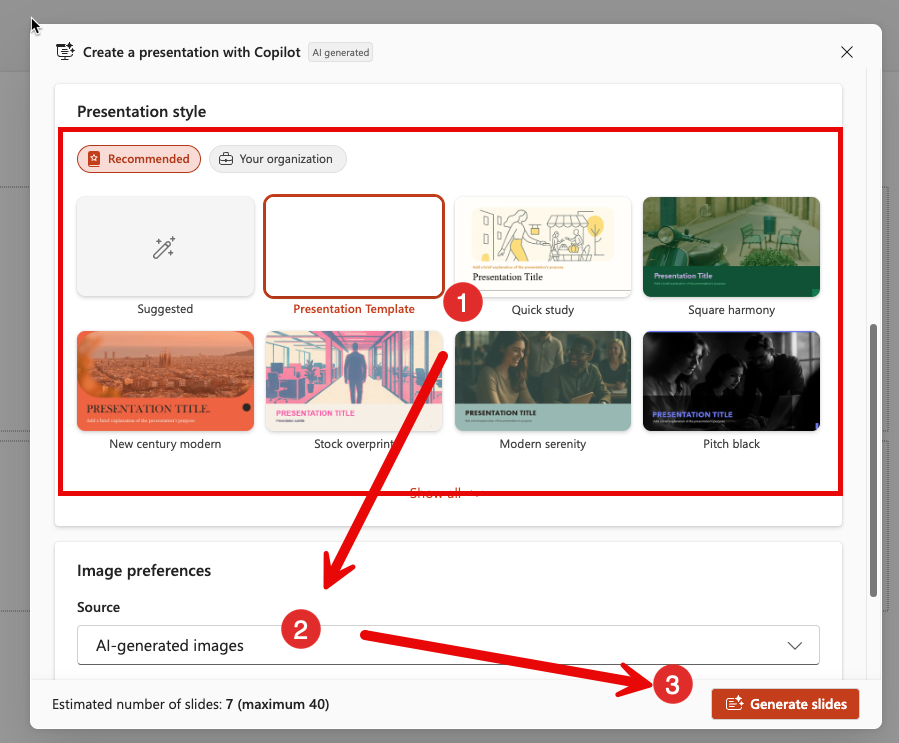

# Copilot in Powerpoint

> ในแบบฝึกหัดนี้ การใช้งานจะแตกต่างกันตามประเภทของ Account ที่ใช้งาน Copilot นะครับ

## Step 1: เตรียมตัวก่อนเริ่มใช้งาน

1. เปิด Powerpoint ใน Microsoft 365 บนเว็บเบราว์เซอร์ [https://powerpoint.cloud.microsoft/](https://powerpoint.cloud.microsoft/) ด้วย account ที่มี 

## Step 2: สร้าง Presentation จากเนื้อหาไฟล์ (สำหรับผู้ใช้ที่มี License)

   1. กดปุ่ม Copilot จากด้านบนซ้ายของ slide หน้าที่เปิดอยู่ปัจจุบันตามภาพ 
      
   2. เลือกคำสั่ง "Create a new presentation with file" 
      
   3. ค้นหาไฟล์ **OpsReport_ExecutiveSummary.docx** ที่เราบันทึกไว้ใน exercise ที่แล้ว และเลือกไฟล์ เพื่อใส่ลงไปใน prompt
      
   4. กดปุ่มส่ง
    
      
   5. เลือก template ของงานนำเสนอ > เลือกรูปแบบของรูป เป็น Stock Image > กดปุ่ม Generate Slides เพื่อสร้างสไลด์
   
   6. รอ และตรวจสอบผลลัพธ์
     
