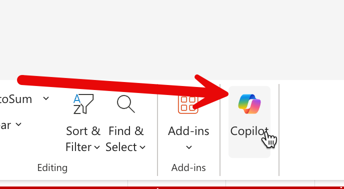

#  Data Exploration with Copilot in Excel

## Step 1: เปิดไฟล์ Excel และเปิด Copilot Chat

1. จาก OneDrive ให้เปิดไฟล์ Excel ตัวอย่าง (CPALL_Lab_Excel_KPI_DC_28days.xlsx)
2. เปิด Sheet "Summary"
3. เปิด Copilot Chat ใน Excel โดยกดที่ปุ่ม Copilot ด้านขวาบนของ Excel



## Step 2: ถามภาพรวม (Trend & Overview)

ในช่อง prompt ของ Copilot ให้ copy prompt และ paste ข้อความด้านล่างนี้เข้าไป 

```
สรุปภาพรวมผลการปฏิบัติการของศูนย์กระจายสินค้าทั้ง 4 แห่ง
ในช่วง 28 วันที่ผ่านมา
พร้อมบอกแนวโน้มที่น่าสังเกต
```

## Step 3: หา Anomaly / ความผิดปกติ

1. เปิด sheet **KPI_Raw**
2. ในช่อง prompt ของ Copilot ให้ copy prompt และ paste ข้อความด้านล่างนี้เข้าไป 

```
ใส่สีพื้นหลังของ cell ในส่วน column อัตราการผิดพลาดการหยิบ เป็น 3 เฉดสีแดง เป็นโทนอ่อน-กลาง-เข้ม ตามช่วงของข้อมูล
```

3. ในช่อง prompt ของ Copilot ให้ copy prompt และ paste ข้อความด้านล่างนี้เข้าไป 

```
ช่วยตรวจหาวันหรือศูนย์กระจายสินค้าที่มี
1) อัตราส่งตรงเวลา ลดลงผิดปกติ
2) ชั่วโมง OT สูงกว่าค่าเฉลี่ยอย่างมีนัยสำคัญ
3) เหตุการณ์ความปลอดภัยสูงผิดปกติ
ช่วยสรุปเป็นตารางสั้น ๆ เป็น sheet ชื่อ Anomaly 
```

## Step 4: โฟกัสประเด็นสำคัญ

ในช่อง prompt ของ Copilot ให้ copy prompt และ paste ข้อความด้านล่างนี้เข้าไป 

```
จากข้อมูลทั้งหมดนี้
เลือก 3 ประเด็นที่ผู้บริหารควรทราบมากที่สุด
พร้อมอธิบายสั้น ๆ ว่าทำไมประเด็นนี้จึงสำคัญ
```


## Expected Output (สิ่งที่ควรได้)

- รายการ trend
- รายการ anomaly
- Bullet insight เชิงข้อมูล 